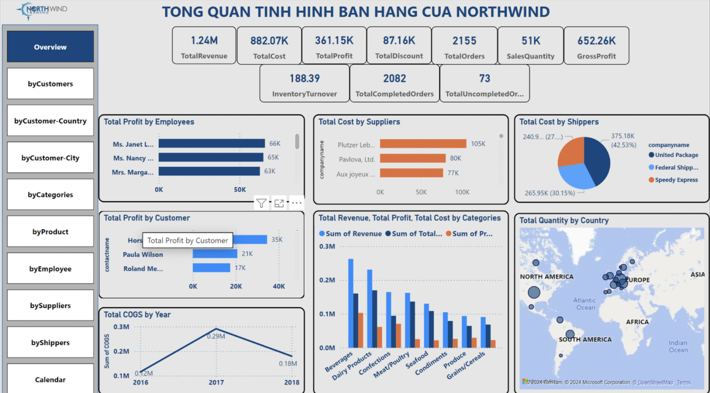
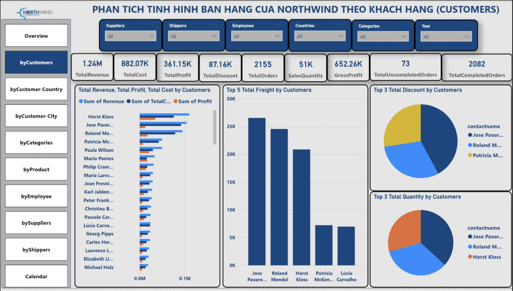
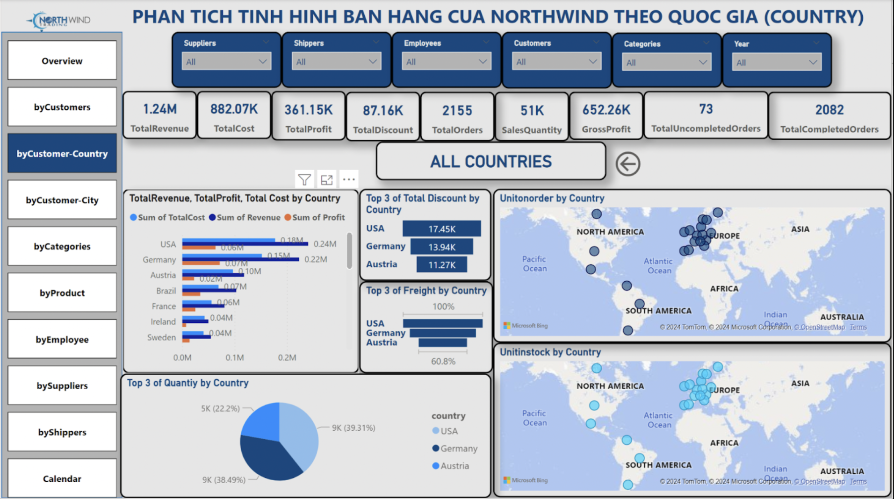
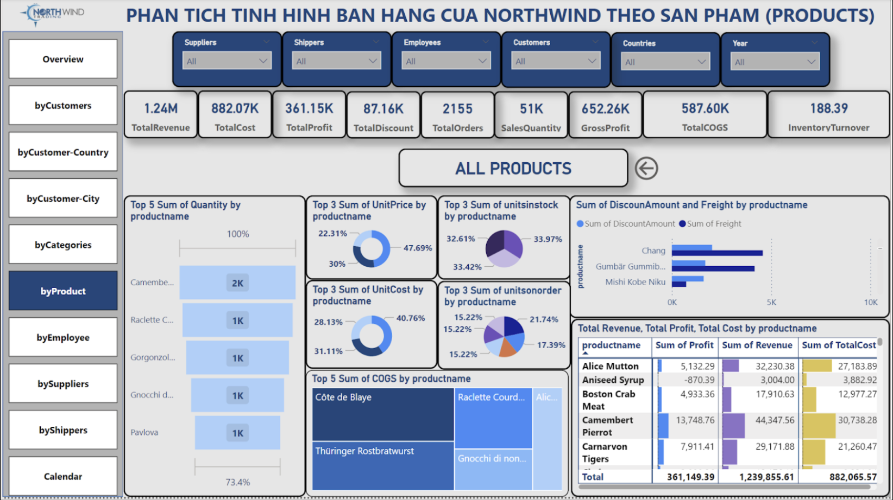
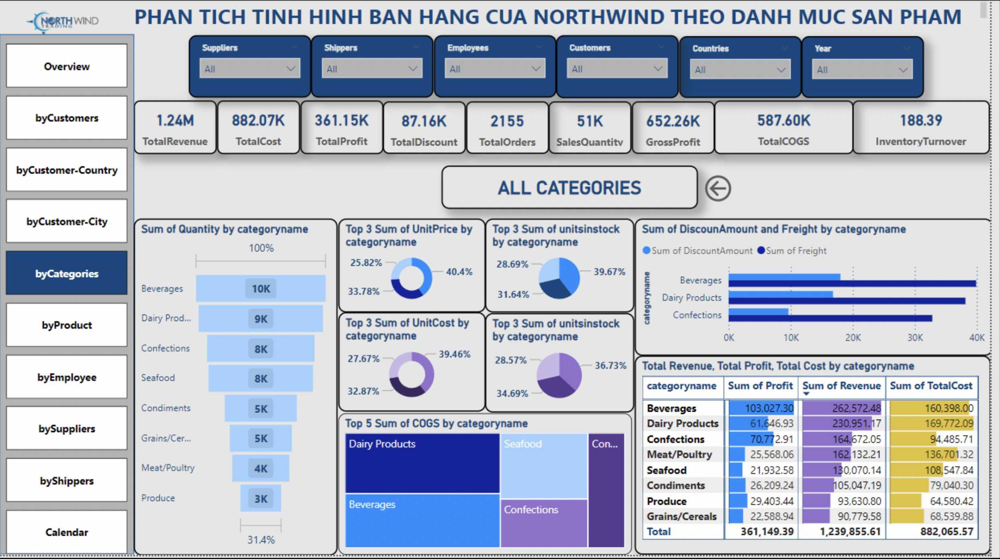
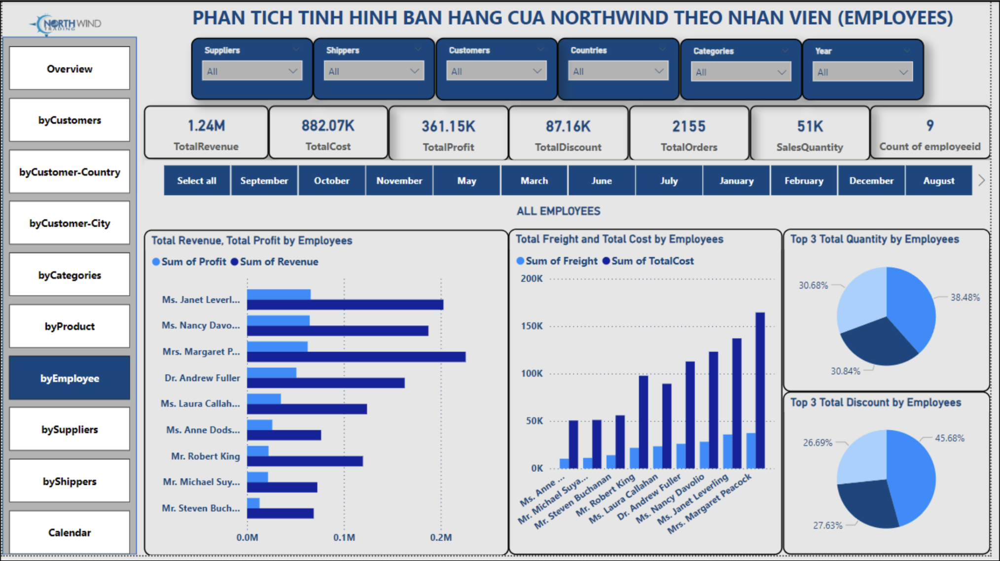
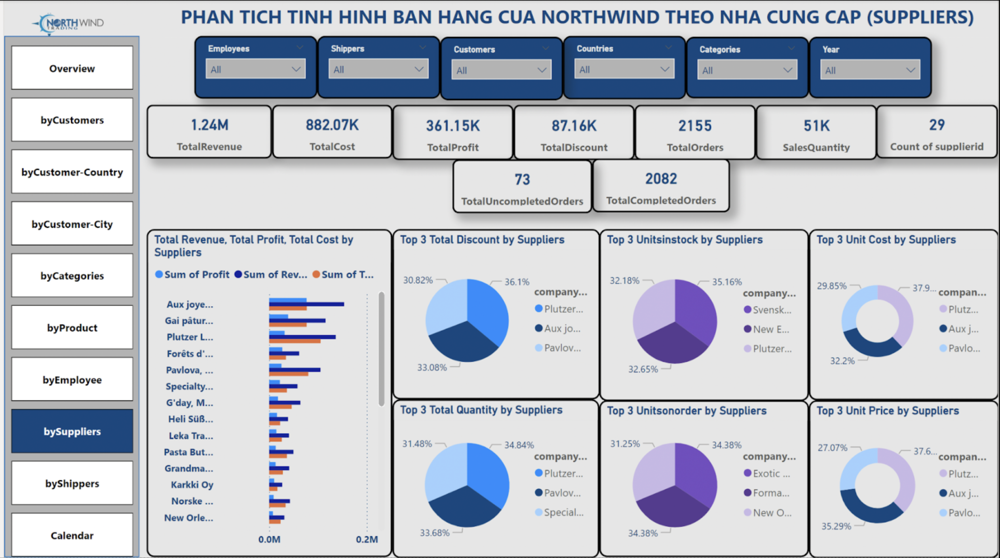
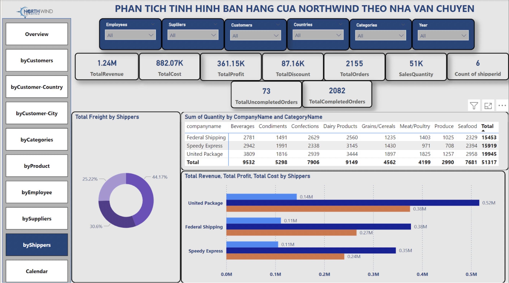
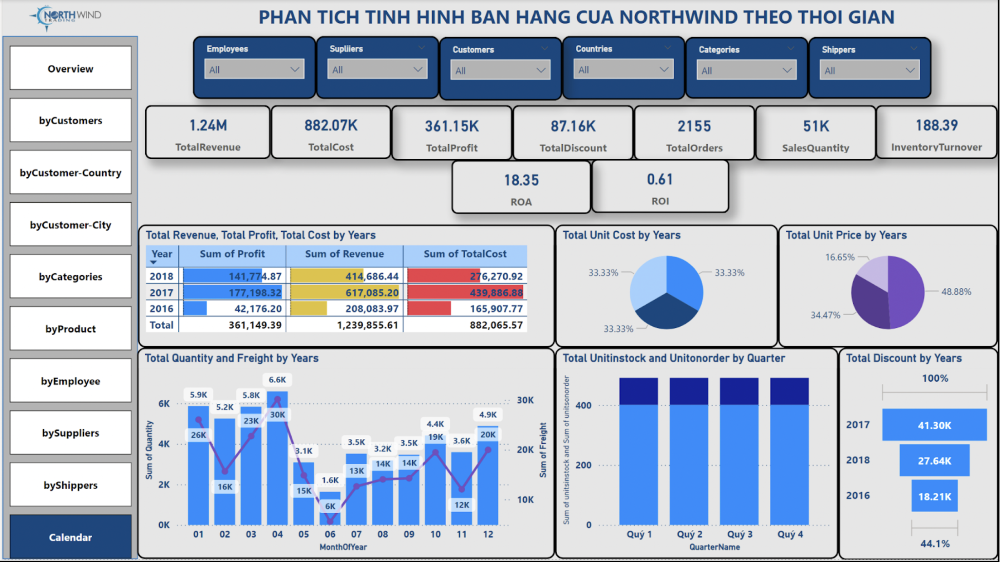

# northwind-sales-analysis
End-to-end sales analysis using Python, R, and Power BI

## Overview
This project analyzes sales data from the Northwind database to uncover insights about customer behavior, product performance, and business operations.

The company wants to understand sales performance, customer behavior, and operational efficiency in order to improve profitability and optimize decision-making.

The goal is to support data-driven decision-making through Business Intelligence and advanced analytics.

## Objectives
- Analyze sales performance across regions, products, and customers
- Identify key drivers of revenue and profitability
- Segment customers using RFM analysis
- Forecast revenue trends
- Provide actionable business recommendations

## Tools Used
- Excel + Python (Data Cleaning & Processing)
- R (Customer Segmentation & Forecasting)
- Power BI (Dashboard & Visualization)

## Dataset
- 11 tables (Orders, Customers, Products, Employees, etc.)
- 82 columns
- Sales, logistics, and customer data

## Data Processing
- Cleaned missing values and encoding issues
- Removed redundant columns
- Created new features (Revenue, Full Name)
- Built Snowflake schema in Power BI

## Analysis

### Sales Performance
- Total revenue reached approximately $1.24M over a 3-year period, indicating stable business operations.
- Profit accounted for around 29% of total revenue, suggesting that costs have a significant impact on profitability.
- High spending on promotions and discounts contributed to revenue growth but may reduce overall profit margins.
- Inventory turnover is high, indicating efficient inventory management and strong sales flow.

Business implication:
- The company should optimize cost structure, especially promotional expenses, to improve profit margins while maintaining revenue growth.

### Customer Analysis
- A small group of customers contributes a significant portion of total profit, highlighting a concentration of high-value customers.
- Loyal customers generate consistent revenue over time, acting as key drivers of business performance.
- Customer segmentation (RFM analysis) reveals distinct groups with different purchasing behaviors and values.

Business implication:
- Focus on retaining high-value customers through personalized strategies and loyalty programs.
- Develop targeted campaigns to increase engagement from low-value segments.

### Product Analysis
- A limited number of products dominate total sales, indicating dependency on key product lines.
- Some products generate high revenue but relatively low profit margins due to associated costs or discounts.
- Product performance varies across categories, suggesting opportunities for portfolio optimization.

Business implication:
- Prioritize high-margin products in marketing and sales strategies.
- Re-evaluate low-margin products and adjust pricing or cost structure.

### Operational Analysis
- Shipping and operational costs vary across suppliers and regions, directly affecting profitability.
- Supplier and logistics performance plays a critical role in maintaining service efficiency.
- A small number of orders remain unfulfilled, indicating minor inefficiencies in order fulfillment processes.

Business implication:
- Optimize supplier selection and logistics to reduce operational costs.
- Improve order fulfillment processes to enhance customer satisfaction.

## Dashboard Preview
### Overview

### Customer Analysis

### Country Analysis

### City Analysis

### Product Analysis

### Category Analysis

### Employee Performance

### Supplier Analysis

### Shipper Analysis

### Time Analysis

## Project Structure
- data/
- notebooks/
- r_scripts/
- powerbi/
